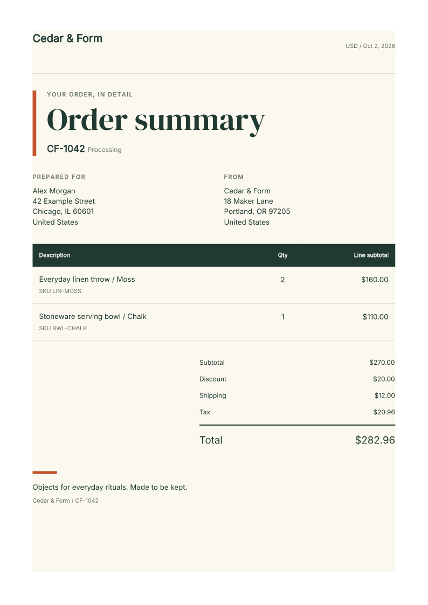
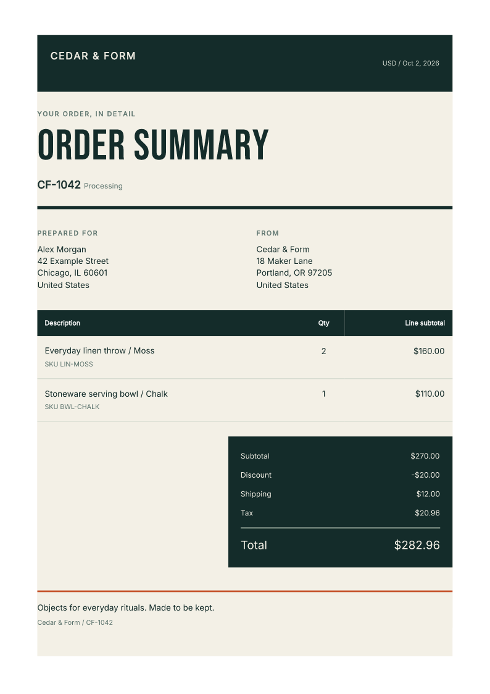
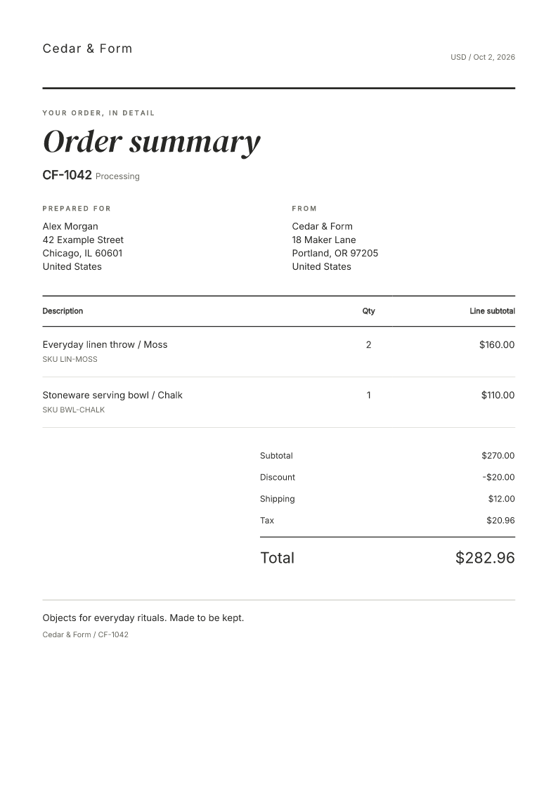
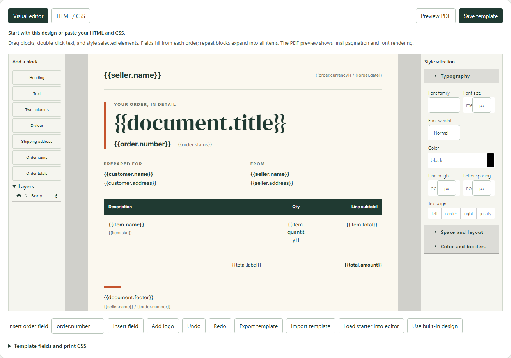

# Fullbleed Commerce

Designed order documents for online stores, powered by the unchanged MIT-licensed
Fullbleed engine. **Developer preview; paid sales and marketplace listings are not live.**

## Products

| Package | What is implemented | Distribution direction |
| --- | --- | --- |
| Fullbleed Commerce for WooCommerce | Order summaries and packing slips, visual and HTML/CSS template editor, embedded logos, PDF previews, Studio design, local browser generation | Free entry plugin; no account, quota, watermark, or telemetry |
| Fullbleed Commerce Pro | Contrast and Quiet designs, up to 25 orders as a ZIP, automatic email attachments and customer account downloads through an optional server renderer | Separate paid download, updates and support; proposed $79/year for one store, hosting separate |
| Fullbleed Commerce for Shopify | Visual and HTML/CSS template editor, three designs, native Flow actions, expiring document links, persistent activity/retry/revoke controls, authenticated previews and subscription checks | App subscription; proposed $12/month starting tier, subject to operating-cost and merchant validation |

Prices are hypotheses, not live offers. Checkout, paid subscriptions and marketplace
listings are not live. The engine remains available independently
under MIT; WordPress plugin code is GPL-compatible. See [LICENSE](LICENSE).

| Studio | Contrast | Quiet |
| --- | --- | --- |
|  |  |  |

These are actual Fullbleed PDF renders with synthetic order data. Generate the
PDFs locally with `npm run examples`.

## Try the WooCommerce preview

[Open a sample store in your browser](https://playground.wordpress.net/?storage=temp&blueprint-url=https://raw.githubusercontent.com/fullbleed-engine/fullbleed-commerce/main/playground/blueprint.json).
Try the free editor and download real PDFs from two fictional orders without an
account, payment or store connection. The sample store is temporary; export your
template to keep it. The [walkthrough](https://docs.fullbleed.dev/guides/woocommerce/)
includes an actual sample PDF and explains the automated workflows.

Download the free plugin from the
[WooCommerce preview release](https://github.com/fullbleed-engine/fullbleed-commerce/releases/tag/v0.1.0-alpha.3).
Use a staging store. Install WooCommerce, then upload
`fullbleed-commerce-0.1.0-alpha.3.zip` in WordPress Plugins. Open
**WooCommerce → Fullbleed documents**, enter a numeric order ID, and generate a
PDF. An order edit screen also has a **Create Fullbleed PDF** link.

To evaluate Pro, upload the separate Pro ZIP after the base plugin. Select orders
on the Orders screen and choose **Create Fullbleed PDFs**, or enter comma-separated
IDs in the document form. Pro's workflow and design code ship separately from the
free plugin. There is no license lock in the free package.

WordPress hosting does not need Node, Python, a PDF service, or custom fonts.
JavaScript, fonts, and the WebAssembly engine are served by the merchant's own
WordPress site. Authorized staff read an order over WordPress's authenticated REST
API; rendering occurs in a dedicated worker in that browser. This plugin sends no
customer data to Fullbleed and stores no generated documents.

## Upgrade the preview

Back up your staging store and export your templates first. Upload the new free
ZIP through **Plugins > Add New > Upload Plugin**, then choose **Replace current
with uploaded**. If you use Pro, replace its ZIP next. Keep both packages on the
same release; the base is upgraded first. Do not delete the plugins to update them.

Saved summary and packing-slip templates, their revisions, and existing automation
settings are retained. An enabled automation remains enabled after an upgrade;
check its connection and one synthetic order before returning to normal use.
The [release verification](docs/verification.md) records the upgrade checks and
which configurations were exercised. The preview still has no automatic updater.

## Customize templates

In WooCommerce, choose a document type and select **Customize selected document**.
In Shopify, open **Template studio**. Each document type has its own saved template.

Use the visual editor to move blocks, edit text, insert fields, and style type,
spacing, colors and borders. Switch to **HTML / CSS** to paste static markup or
print styles. Upload an embedded PNG/JPEG logo, preview a PDF using an authorized
order, then save. Export/import JSON backups, load a starter, or restore the
built-in design. The free WooCommerce plugin includes this editor.

Order fields such as `{{order.number}}` are escaped text. Repeated item and totals
blocks expand for each order; prices are copied from the platform. Templates
control their own paper and print CSS. The visual canvas is a layout aid; the
Fullbleed PDF preview is the check for final typography and pagination.
See [the template guide](docs/templates.md) for fields, loops and supported input.



## Automate documents

WooCommerce Pro can attach the saved order-summary design to selected existing
transactional emails through an optional server renderer. It can also add an
**Order summary PDF** action to My Account so buyers retrieve their own eligible
orders without staff assistance. Both features start disabled and reuse the saved
template. Failed rendering preserves the original email or account page and
records a merchant-visible error. See the
[WooCommerce automation guide](automation/README.md).
Store operators and agencies can use the
[private renderer deployment](automation/DEPLOYMENT.md) for an HTTPS proxy,
credential provisioning, bounded container resources, maintenance and rotation.
It runs on infrastructure the operator controls; it is not a hosted plan.

Alpha.3 adds **Fullbleed activity**: the latest email-attachment and
customer-download results, a failure filter, recovery guidance and native order
links. Successful retries clear stale failures. It reports PDF preparation,
not customer receipt. See the
[activity and retention details](automation/README.md#merchant-activity-and-recovery).

Current source also includes opt-in administrator failure summaries, with hourly
checks, one mail attempt per 24 hours and a link to recovery guidance. These alerts
are not in the published alpha.3 ZIP. They need working WordPress scheduling and
email; they never resend customer mail. See [failure alerts](automation/README.md#administrator-failure-alerts).

Shopify adds **Create order summary link** and **Create packing slip link** to
Flow. Enable automation, connect an order trigger, and use the returned private
link in your next workflow step. Jobs survive restarts, duplicate events reuse
the same job, and transient failures have bounded retries. Review activity,
retry preparation, revoke one link, or pause all automation in the app.
See the [Flow setup and reliability contract](shopify/FLOW.md).
The [order-arrival recipe](shopify/recipes/order-documents.md) automatically
prepares both PDFs and saves private links and expiry times on the Shopify order.
It is verified with an actual synthetic order trigger and browser downloads.

These are development integrations. Customer delivery, production hosting,
privacy operations and paid lifecycle validation remain launch gates. The
[privacy request workflow](shopify/PRIVACY.md) now captures encrypted exports and
tracks merchant handling independently of paid-plan access.

## Evaluate an automation with us

Running a WooCommerce store or building one for a client? Start with the free
sample store, then [describe the document task you want to automate](https://github.com/fullbleed-engine/fullbleed-commerce/issues/new?template=commerce-pilot.yml).
Tell us what should trigger it, who needs the document, and whether you can run
a private renderer or need managed hosting. Shopify developers can describe a
Flow workflow for a development store.

The first evaluation covers a saved design, one normal order, one long order,
and what happens when rendering fails. Keep tests on staging with fictional data.
The request is public and does not purchase a service or reserve a launch date.
For a private inquiry, [contact Fullbleed](https://www.fullbleed.dev/contact).

## Development

The development toolchain requires Node.js 24.18+ because of WordPress Playground.
The rendering integration itself uses the published Fullbleed Node 0.1.1 package,
containing engine 2.5.5, pinned to its GitHub release tarball and npm lock integrity.

```sh
npm ci --ignore-scripts
npm run build
npm test
npm run examples
npm run pack
```

`output/examples` contains real PDFs, PNG previews, and hashes. `dist` contains
installable plugin ZIPs and SHA-256 sums. Source and build instructions accompany
the base ZIP; the add-on's complete readable JavaScript and sources accompany Pro.

Run a disposable local test store (downloads WordPress and WooCommerce):

```sh
npm run dev:wordpress -- --pro --hpos
python tools/check-wordpress.py
```

The HTTP verification script uses Python `requests`. The store binds to
`127.0.0.1:9475`. Credentials are synthetic local-test data: `admin` /
`fullbleed-local-test`. Never use that fixture script or password on a merchant
site. Omit `--pro --hpos` to test the free package with legacy order storage.

## Current verification and limits

See [docs/verification.md](docs/verification.md) for checks and gaps. Node generation,
the browser-worker runtime, DOM workflows, WordPress authentication, and actual
WooCommerce order reads are checked separately. DOM simulation is not a real
Chrome/Safari test or Shopify approval.

Alpha.3 packages the merchant activity view and WordPress editor fixes. All 45
shared tests pass. Upgrades from the actual alpha.2 ZIPs preserve templates,
revisions and automation settings in HPOS and legacy storage. Real Chrome checks
cover the upgraded Pro store, free sample store and native WordPress installation.
Both released ZIPs match Windows and Linux builds. See the
[alpha.3 release evidence](docs/alpha3-release-verification.json) for exact source,
archive hashes, automation checks and browser results. Historical release checks
remain separately identified in the verification guide.

The unchanged alpha.3 base and Pro ZIPs also pass merchant editing and customer
account-download journeys in Chrome, Playwright Firefox and Playwright WebKit
on Windows and Linux. Each combination passes 24 checks and produces identical
PDF bytes for the fixtures. See the [browser workflow matrix](docs/verification.md#browser-workflow-matrix)
for exact versions, reproducible CI and limits; this is not branded Safari or
physical-device coverage.

This preview produces order summaries, not fiscal invoices. It preserves store
display amounts and does not calculate tax, create invoice numbers, or reconcile
refunds. Refunded orders are rejected. Shopify edited orders are also rejected.
Pro includes opt-in development integrations for existing WooCommerce email
attachments and customer account downloads through an optional server renderer. See the
[automation setup and limits](automation/README.md). Automatic missing-attachment
retries, license updates, checkout, multilingual font selection and production
hosting remain unimplemented.

Limits: 250 items/order, 30 PDF pages, 30 seconds per render, 25 orders and 50 MiB
of PDF bytes per Pro batch. Unsupported characters fail rather than silently
dropping glyphs. Validate the layouts on representative merchant orders before
production use.

## Commercial launch

The proposed paid value is merchant workflow, original document design, updates,
and support. The first launch leads with WooCommerce; Shopify reuses the same
document layer. Product care cards, gift inserts, and form-to-PDF integrations are
later options after the first merchants show demand.

The [production product plan](docs/product-plan.md) now makes native automation
the paid product's central value: WooCommerce email and order workflows, Shopify
Flow, customer downloads, fulfillment batches and visible failure recovery. It
distinguishes development milestones from the requirements for a paid launch.

The launch budget is **$50 total**. Confirmed charges remain **$0**; the attended
Railway staging test has accrued less than one cent of metered resource usage.
Compute is stopped between tests, with its persistent volume retained. The
proposed $19 Shopify registration fee is within the cap. Usage and actual charges
are recorded in [docs/launch-budget.json](docs/launch-budget.json).
More than $50 requires explicit user approval.

Before selling: complete real-browser and staging-store checks; finalize support,
delivery/update, privacy and refund terms; connect a sales account; test purchase,
download and renewal behavior; and verify the paid product against merchant needs.
For Shopify, complete protected-data and browser tests, verify platform billing,
deploy the app, then submit it for review. The Partner connection, development
app and installation already exist. See [shopify/README.md](shopify/README.md)
for the precise status and [app development instructions](shopify/app/README.md).

## Platform and market evidence

Checked October 2, 2026; recheck before launch.

- WordPress.org permits GPL-compatible free plugins and separate externally sold
  add-ons. It prohibits trialware or locking functional code already included in
  a directory plugin. [Official plugin guidelines](https://developer.wordpress.org/plugins/wordpress-org/detailed-plugin-guidelines/).
- Shopify App Pricing is the default for supported new public-app billing models;
  subscription state must be verified server-side using the Partner API.
  [Official billing documentation](https://shopify.dev/docs/apps/launch/billing/shopify-app-pricing).
- Shopify lists a $19 one-time App Store registration fee per Partner account.
  [Official distribution fees](https://shopify.dev/docs/apps/launch/distribution/revenue-share).
- There are established paid competitors. At the check date, Order Printer Pro
  listed $10/month for its first paid tier, and a WooCommerce PDF invoice/builder
  product listed $49/year. This supports testing a paid workflow product; it does
  not prove demand for Fullbleed or justify a revenue forecast.
  [Shopify listing](https://apps.shopify.com/order-printer-pro),
  [WooCommerce listing](https://woocommerce.com/products/pdf-packing-slips-and-invoice-builder/).
