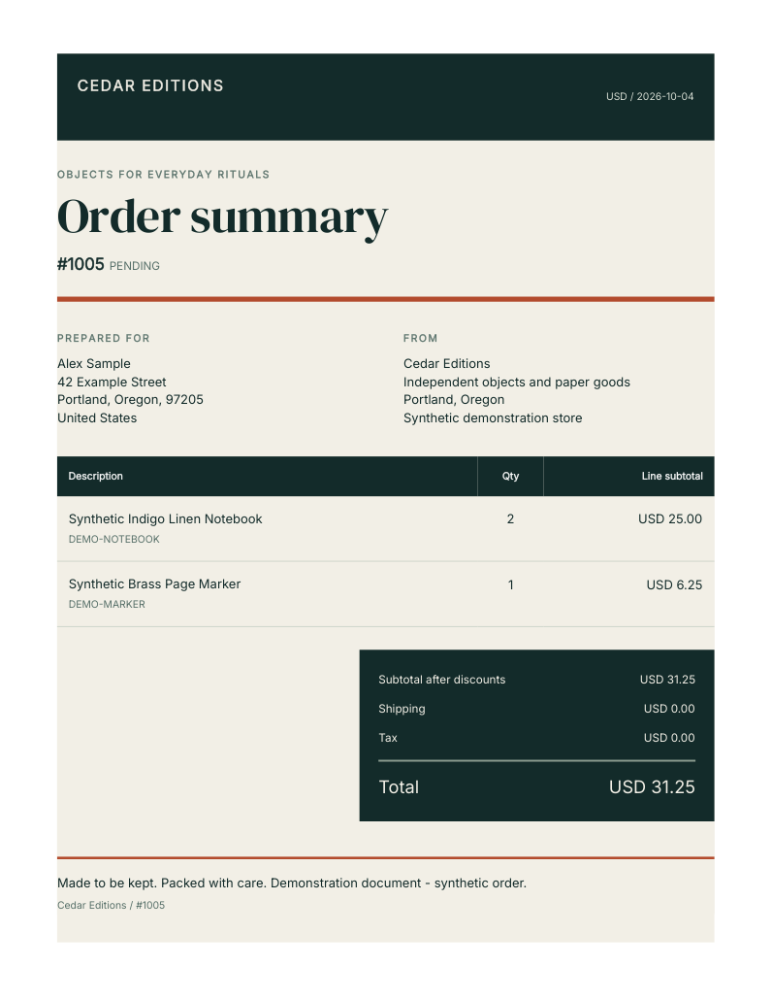
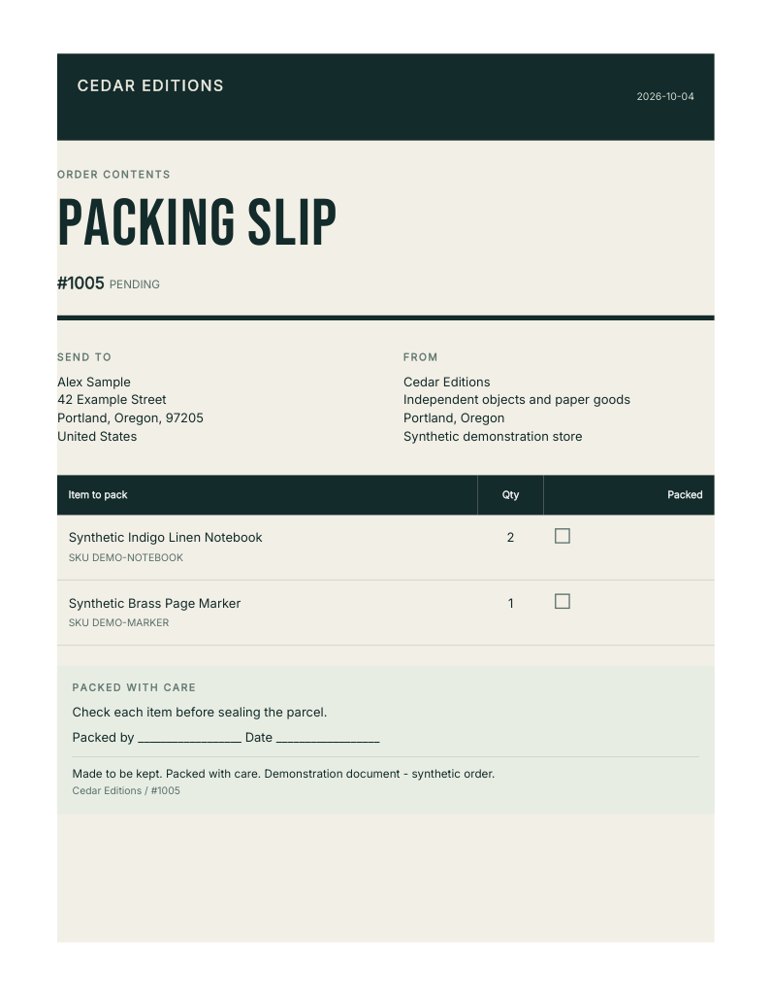

# Development app: checkout to automated PDFs

**Fullbleed Commerce Dev** completed a fresh Shopify installation, the private
$0 test-plan checkout, template editing, and a real **Order created** workflow
on October 4, 2026. Both PDFs downloaded through the links saved by Shopify Flow.
The test app was then uninstalled and staging compute stopped.

This was an attended synthetic-store check with `NODE_ENV=production`, Shopify's
real Partner API, and no development billing bypass. It does not establish paid
merchant operation or App Store approval. The
[verification record](development-activation-verification.json) identifies the
source, deployment, checks, hashes, cleanup and retained evidence archive.

## What a merchant can automate

1. Save branding and a separate design for each document type. The browser check
   changed an order-summary starter through the HTML/CSS editor, saved it, and
   confirmed the custom heading and CSS after reloading. The PDF preview showed
   the result before automation was enabled.
2. Add **Create order summary link** and **Create packing slip link** to an order
   workflow. The test uses the released development-app actions, with no CLI
   development preview running.
3. Use their outputs in following steps. Here, four native Flow actions saved
   the private links and expiry times to staff order fields. A diagnostic step
   logged document hashes and link checksums. It did not log access credentials,
   send email, collect payment, or mark the order fulfilled.

The new unpaid synthetic order **#1005** triggered all seven actions. Both
documents were ready on their first preparation attempt. The summary used the
saved Cedar Editions design and preserved **USD 31.25**; the packing slip omitted
prices. Actual Chrome downloads matched the hashes recorded by Flow. Both are
one page with embedded fonts; visual inspection found complete addresses and
item rows without clipping or overlap.

| Custom order summary | Packing slip |
| --- | --- |
|  |  |

These samples contain fictional brand, recipient and order data. The existing
[Flow recipe](../shopify/recipes/order-documents.md) explains the staff destination.

## Setup and fixes verified

The development app has Name and Address access selected, a private `shopify-test`
plan restricted to the synthetic store, and its own Partner API credential.
That credential has **Manage apps** permission across the same Partner
organization; it is a different credential, not an app-scoped permission. The
public app's configuration and complete version history remained unchanged.

A fresh install exposed a checkout bug: accepting the agreement could leave the
embedded app displaying `200`. [PR #32](https://github.com/fullbleed-engine/fullbleed-commerce/pull/32)
preserves Shopify's authenticated redirect destination and parameters while
making React Router reload the document. A real-SDK regression failed against
the previous response. The new hosted install reached Shopify pricing without
a manual reload, approved the $0 plan and opened Documents. All 19 local Shopify
verification groups, 32 local Chrome checks and 17 PR checks passed. Checks on
the merged commit passed as well.

The first unrelated WooCommerce Chrome run passed its functional checks but
reported a browser page-transition abort. An unchanged rerun passed with the
zero-page-error assertion retained. Both results are archived; the exact timing
cause has not been reproduced.

The first development-app release preceded selection of public distribution.
Flow actions became discoverable after releasing the same configuration as
`development-flow-20261004` (version `1154436071425`). The old public-app nodes
were replaced, their downstream references checked, and the workflow applied
before creating the order.

## Final state and remaining limits

Pausing automation revoked both links: their download requests returned **410**.
The workflow is off. Uninstall through Shopify Admin delivered a **204** webhook,
left all **11 merchant-data tables empty**, and changed both download responses
to **404**. The $0 contract remains visible through the Partner API with
`cancelAtEndOfCycle: true`; uninstall and contract cancellation are separate
observations. Both operator sessions have authenticated completion receipts.

Staging compute is stopped; its volume and encrypted recovery bucket remain.
Production compute has never been activated. Confirmed launch charges remain
**$19** within the **$50 total cap**; provider metering and its limitations are in
[the budget](launch-budget.json).

Merchant admission still requires the provider agreement, production routing
and deployment verification, continuous monitoring and retention with missed-check
detection, an ongoing operating budget, paid-plan lifecycle checks, protected-data
review and App Store approval. Customer email delivery, merchant pilots and
sustained capacity are separate checks.
