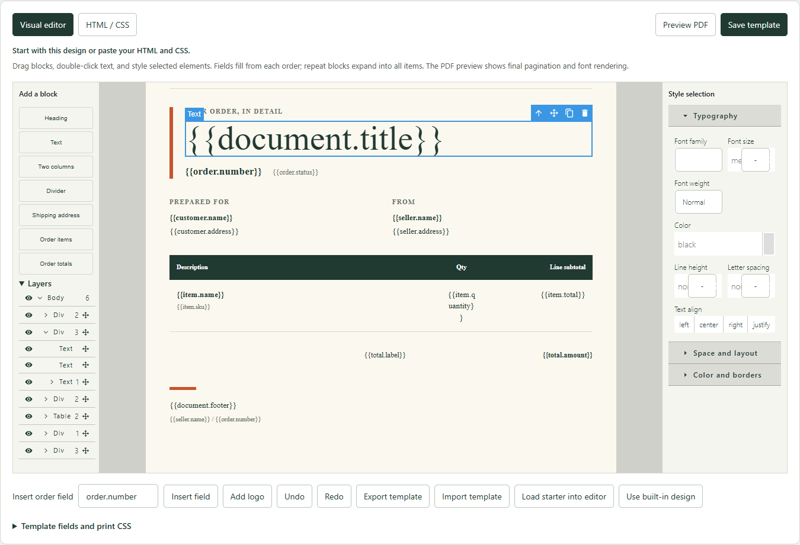
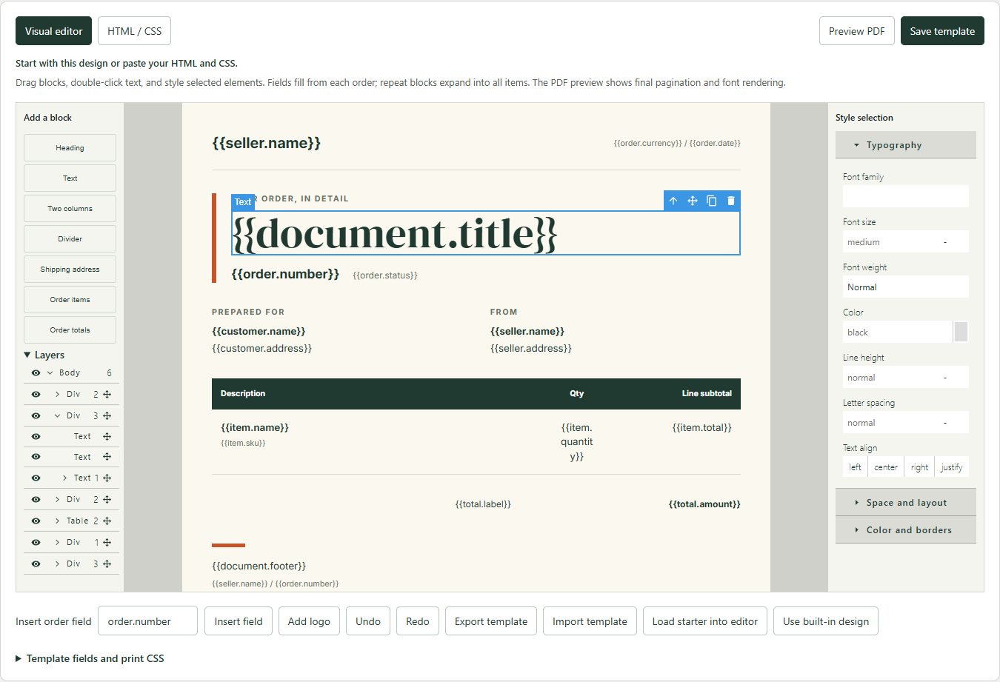

# Visual editor fonts and typography controls

The free plugin's visual canvas could show fallback fonts in WordPress
Playground while its PDF used the correct bundled fonts. Version **0.1.4**
loads those fonts through the host document and supplies their bytes directly
to the canvas. It also makes typography properties full width and scopes the
inspector's input spacing, so WordPress and the editor toolbar do not clip its
values and unit menus.

## Reproduced failure

A fresh public sample store running the unmodified **0.1.3** release returned
**404** for the canvas's Inter and DM Serif Display font requests. Fetching the
identical URLs from the host WordPress document returned **200** and valid font
bytes. A binary font-face probe in that canvas loaded successfully. The iframe's
font requests were not served through the same Playground service-worker route.

The [verification record](editor-fonts-verification.json) retains those requests,
the successful probe, the candidate bundle hashes and the actual browser checks.
The investigation used fictional orders in a disposable store only.

| Released 0.1.3 canvas | Candidate canvas with the fix |
| --- | --- |
|  |  |

## What was checked

- A fresh public Playground running the released package, with only the candidate
  editor JS/CSS injected into the owned test context, loaded all **four font
  faces**: variable Inter, regular and italic DM Serif Display, and Bebas Neue.
  Its font-size value had **106 px** of usable width; the unit selector had
  **44 px**. This is candidate evidence, not a claim that a release was published.
- A local WordPress **7.1.3**, WooCommerce **11.1.2**, PHP **8.3.33** HPOS store
  passed **46 authorization and template checks** and **14 Chrome checks**:
  actual bundled fonts, editable blocks and text, saved HTML/CSS, complete PDF
  previews and downloads, reload persistence, reset, and mobile page width.
- **68 Node tests** passed, including deterministic PDF generation, template
  validation and browser-worker output. Default and custom browser PDFs were
  rasterized with an independent PDFium reader and visually inspected.
- The candidate free ZIP changes only the editor JS/CSS, their source and build
  metadata, and version/readme metadata. Its engine, font files, worker and admin
  bundle match 0.1.3. The Pro **0.1.2** ZIP is byte-identical to its public release.

The earlier local authorization attempt and browser test overlapped on the same
synthetic store; the authorization test failed its template-save assertion.
The authorization checks then passed when run separately. The first candidate
capture also selected an old iframe during an asynchronous reopen; the capture
tool now waits for that iframe to disappear before inspecting its replacement.
Neither failure was suppressed or treated as a passing check.

The standalone canvas still uses template fields rather than customer data.
Use **Preview PDF** to inspect pagination and final print layout. This editor
change does not establish marketplace approval, production merchant operation,
or resolution of the separate Node native-crash investigation.
