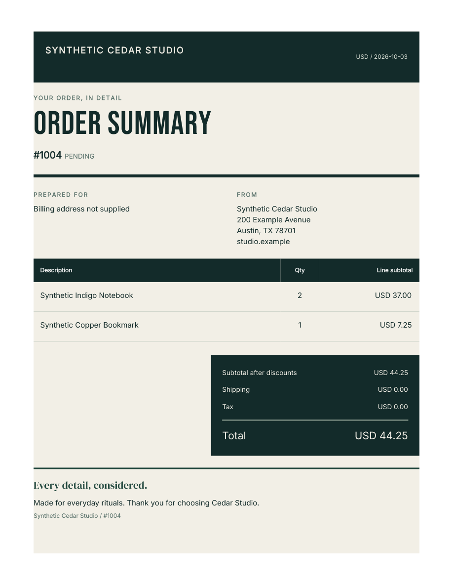
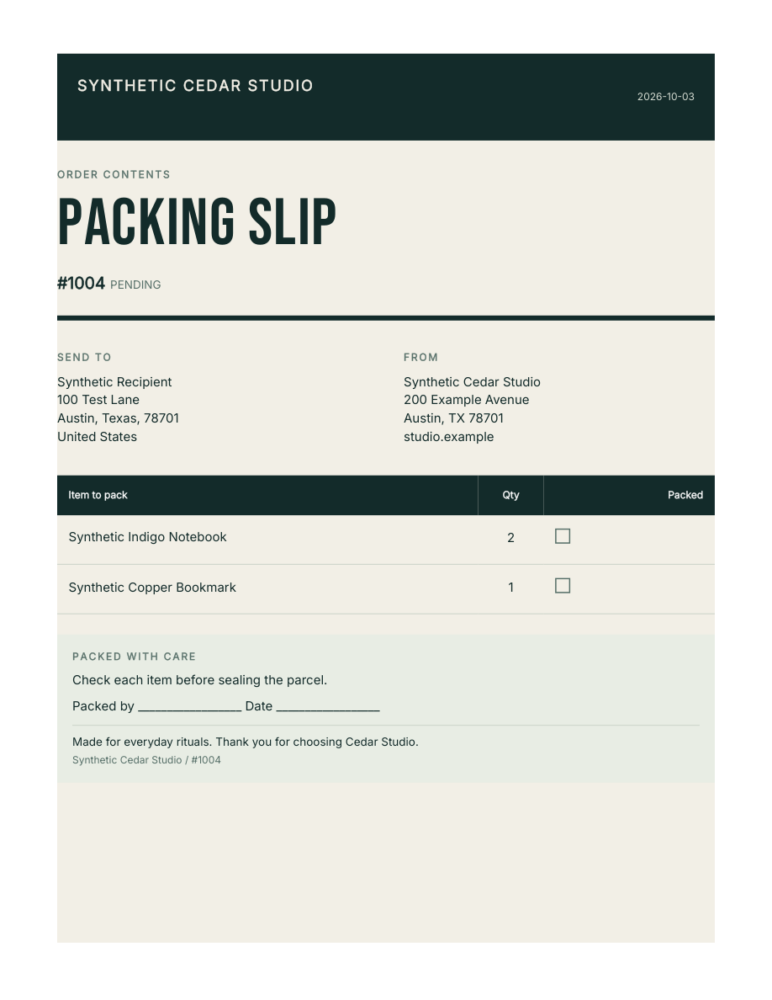

# Hosted Shopify document workflow

A saved custom design now runs automatically from Shopify Flow on the stable
staging host. An actual synthetic order triggered both Fullbleed actions, saved
four private order fields, and produced the expected browser downloads with
production subscription checks enabled. The check ran October 3–4, 2026 UTC.

The [machine record](hosted-workflow-verification.json) identifies the source,
deployments, document hashes, checks and final staging state. This is an attended
development-store test; paid merchant operation and App Store approval remain
unverified.

## What ran

1. Install the released app through Shopify on
   `fullbleed-commerce-test.myshopify.com`. The hosted database began with no
   session; no development database or token was copied to it.
2. Approve the private **$0 test plan** in Shopify's hosted checkout. The server
   uses `NODE_ENV=production`, the real Partner API and no development billing
   bypass. The app still requests only `read_orders`.
3. Save Synthetic Cedar Studio branding and a custom order-summary template in
   the HTML/CSS editor. The Contrast design uses US Letter, adjusted heading and
   spacing, and a serif closing line: “Every detail, considered.” Preview, save
   and reload confirm the design is retained.
4. Complete synthetic order **#1004** as unpaid. **Order created** starts the
   released Fullbleed summary and packing-slip actions. Both prepare on their
   first attempt. Four native Shopify Flow actions save the links and expiry
   times on the order. A diagnostic log records hashes, not download credentials.
5. Download both PDFs in Chrome from those actual order-field links. Summary
   and packing-slip bytes match their prepared hashes. The summary uses the
   saved customization and preserves USD 44.25; the packing slip omits prices.
   Both are one page, with embedded fonts and no clipped or overlapping text.
6. Replace the hosted deployment. The authorized session, brand, custom template,
   job history and working links survive. A manual summary download matches the
   automatic summary byte for byte. Pause Fullbleed, verify both links return
   HTTP 410, and turn the synthetic Flow workflow off.

| Custom order summary | Packing slip |
| --- | --- |
|  |  |

The samples contain fictional store and order data. They are actual downloads
from the hosted workflow. The [recipe](../shopify/recipes/order-documents.md)
explains how the staff destination is configured. The stored fields deny both
Storefront and Customer Account API access. Download pages remove the credential
from the browser location, fit a mobile viewport, and return private/no-store
responses. Possession of a complete link grants access until expiry or revocation.

The app home now leads with **Automate documents** and **Customize templates**.
Manual generation remains available for preview and recovery. Desktop and mobile
checks verified the primary navigation and separated supporting links.

## Problems found and addressed

The old development workflow contained Draft action references. Releasing the
hosted app did not update those references, so the first attempted order failed
before reaching Fullbleed. Replacing both nodes with the released actions and
applying the workflow produced the successful seven-action run above.

A manual download initially returned a subscription-verification 503. Retrying
without changing authentication returned a PDF in about 2.1 seconds. The app
denied access during the verification failure. This one successful retry is not
an availability measurement.

Uninstall exposed a real cleanup failure. The installed Shopify React Router
SDK attempted to refresh the nearly expired offline token after Shopify revoked
it, returning 500 before the erasure handler. The fix uses Shopify's low-level
HMAC validator without loading an Admin session. Twelve new regression tests
cover expired/nearly expired revoked tokens, all lifecycle topics, no outbound
API calls, forged signatures, body/encoding limits, duplicate delivery and store
isolation. The full local Shopify suite passes.

Shopify's sixth delivery of the original uninstall event returned **204** after
the fix. Its webhook ID matched the failed attempts. All seven application
record counts were zero, both old document links returned **404** in Chrome,
and the encrypted erasure instruction read back successfully from independent
recovery storage with its committed database receipt. The private monitor
reported fresh backups and no outstanding privacy requests. The machine record
retains both Shopify's delivery result and the host-side checks.

## Operating limits

Staging compute is stopped between attended checks. The private volume and
encrypted recovery bucket remain; storage is still metered. The synthetic Flow
workflow is off. The $0 subscription is scheduled to cancel at the end of its
cycle; Shopify still returns it through the Partner API after uninstall.
Uninstall and subscription cancellation are distinct checks.

The paid registration fee is **$19** within the **$50 total launch cap**. Current
project usage and its billing caveats are in [the budget](launch-budget.json).
No new hosting subscription or merchant charge was created.

Before accepting merchants, complete actual paid-plan changes and freezes,
pricing and render limits, continuous operator coverage and missed-check
detection, independent recovery of keys, secure handling of late privacy
requests, protected-data review, listing/support/refund terms, and App Store
review. Customer email delivery, Safari, sustained capacity and merchant pilots
are separate checks. The Shopify toolkit's Polaris validator failed in its own
JSX dependency environment; installed types, lint, production build and the
actual browser checks provide the retained UI evidence.
