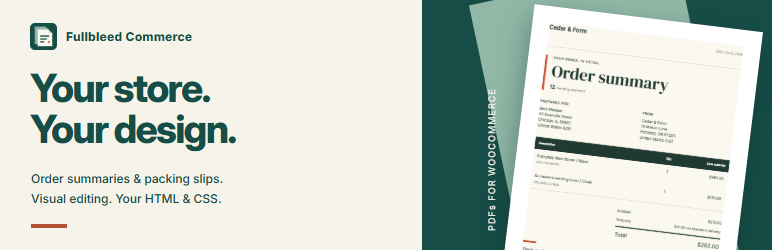

# WordPress directory artwork and preview

This directory and [`.wordpress-org`](../../.wordpress-org/) prepare the free
Fullbleed Commerce **0.1.5** listing. They do not establish WordPress approval or
that the directory assets are live. The published plugin ZIP is not modified by
this artwork build.



The artwork uses Fullbleed Commerce's existing icon, colors and an actual PDF
from its fictional Cedar & Form sample store. Four images show the free document
screen, visual editor, HTML/CSS editor, and resulting PDF. No paid automation
feature is represented as included in the free plugin.

## Files and publication

After WordPress grants the plugin's SVN access, copy the **contents** of
`.wordpress-org` to the SVN repository's top-level `assets/` directory. Keep
them outside `trunk` and version tags:

- `banner-772x250.png` and `banner-1544x500.png`
- `icon.svg`, `icon-128x128.png` and `icon-256x256.png`
- `screenshot-1.png` through `screenshot-4.png`
- `blueprints/blueprint.json`

The generated [readme.txt](readme.txt) is the **0.1.5 release readme plus four
screenshot captions and the optional GitHub Sponsors link**. The funding
profile is public; anonymous page access and GitHub's `isPublic` field were
checked on October 6, 2026. Use these metadata additions in the matching approved
readme; do not overwrite a later release's metadata with this copy. The images
meet the dimensions, filename and size rules in the
[WordPress asset handbook](https://developer.wordpress.org/plugins/wordpress-org/plugin-assets/).

The Blueprint is an exact copy of the repository's tested public sample-store
configuration, pinned to the free 0.1.5 ZIP. It installs WooCommerce and fictional
orders, opens Fullbleed's document screen, and disables outgoing mail and
WordPress networking. After uploading it, use the directory's **Test Preview**
and verify an actual PDF download before setting the preview to public in the
plugin's Advanced view. WordPress describes both required steps in its
[preview handbook](https://developer.wordpress.org/plugins/wordpress-org/previews-and-blueprints/).

## Reproduce

Use Python with `tools/browser-requirements.txt` and Google Chrome. Download the
free ZIP from the matching GitHub release; the artwork builder verifies its
SHA-256 before using its bundled Inter font.

```sh
python tools/capture-wordpress-directory.py --version 0.1.5 --require-fonts --require-local-icons
python tools/build-wordpress-directory.py \
  --plugin-zip dist/fullbleed-commerce-0.1.5.zip \
  --sample-preview path/to/verified-sample-order.png
```

The capture launches and closes its own anonymous browser. It permits only a
temporary public Playground, checks the free plugin version and actual PDF
bytes, requires local icon assets, loaded canvas fonts and readable typography controls, and saves
native UI screenshots. Candidate-editor injection is available for development;
the artwork builder explicitly refuses those captures as released UI evidence.

Use the [sample PDF preview](https://docs.fullbleed.dev/assets/commerce/sample-order.png)
identified by [verification.json](verification.json); its checksum is pinned by
the builder along with the PDF and release ZIP.
The banner combines that real output with HTML/CSS and the existing SVG icon;
the screenshot images are not UI mockups. The record includes hashes, sizes,
dimensions, browser version, and the capture checks. Refresh the pinned ZIP
checksum and recapture after a plugin release; inspect every final image before
uploading directory changes.
